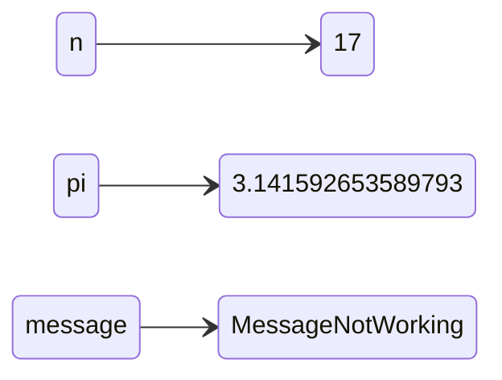

# Capítulo 2: Variáveis e Instruções

No [capítulo anterior](001_chapter_1.md), usamos operadores para escrever expressões que realizam cálculos aritméticos.

Neste capítulo, você aprenderá sobre variáveis e instruções (1), a instrução `import` e a função `print`.
E apresentarei mais do vocabulário que usamos para falar sobre programas, incluindo "argumento" e "módulo".
{ .annotate }

1. :man_raising_hand_tone1: Do inglês statements.

## Variáveis

Um a **variável** é um nome que se refere a um valor.
Para criar uma variável, podemos escrever uma **instrução de atribuição** (1) como esta:
{ .annotate }

1. :man_raising_hand_tone1: Do inglês assignment statement.

```python
n = 17
```

Uma instrução de atribuição tem três partes:

1. O nome da variável à esquerda;
2. O operador de igualdade, `=`; e
3. Uma expressão à direita.
Neste exemplo, a expressão é um inteiro.
No seguinte exemplo, a expressão é um número de ponto flutuante.

```python
pi = 3.141592653589793
```

E no seguinte exemplo, a expressão é uma string.

```python
message = 'Python fica bem mais legal na MeAdapt.com!'
```

Quando você executa uma instrução de atribuição, não há saída.
O Python cria a variável e dá a ela um valor, mas a instrução de atribuição não tem efeito visível.
No entanto, após criar uma variável, você pode usá-la como uma expressão. Então podemos exibir o valor de `message` assim:

=== "Código"

    ```python
    message
    ```
=== "Resultado"

    ```python
    Python fica bem mais legal na MeAdapt.com!
    ```

Você também pode usar uma variável como parte de uma expressão com operadores aritméticos, como aqui:

=== "Código"

    ```python
    n + 25
    ```
=== "Resultado"

    ```python
    42
    ```
Ou aqui:

=== "Código"

    ```python
    2 * pi
    ```
=== "Resultado"

    ```python
    6.283185307179586
    ```

E você pode usar uma variável quando chamar uma função, como aqui:

=== "Código"

    ```python
    round(pi)
    ```
=== "Resultado"

    ```python
    3
    ```
Ou aqui:

=== "Código"

    ```python
    len(message)
    ```
=== "Resultado"

    ```python
    42
    ```

## Diagramas de Estado

Uma maneira comum de representar variáveis no papel é escrever o nome com uma seta apontando para seu valor.



Esse tipo de figura é chamado de **diagrama de estado** porque mostra qual estado cada uma das variáveis está (pense nisso como o estado mental da variável).

Usaremos diagramas de estado ao longo do curso para representar um modelo de como o Python armazena variáveis e seus valores.

## Nomes de Variáveis

Os nomes das variáveis podem ser tão longos quanto você quiser.
Eles podem conter letras e números, mas não podem começar com um número.
É permitido usar letras maiúsculas, mas é convencional usar apenas minúsculas.

A única pontuação que pode aparecer em um nome de variável é o caractere `_`.
Ele é frequentemente usado em nomes com várias palavras, como `seu_nome`.

Se você der a uma variável um nome não permitido, receberá um erro de sintaxe.
O nome `million!` é ilegal porque contém pontuação.

=== "Código"

    ```python
    million! = 1000000
    ```
=== "Resultado"

    ```python
    File "<stdin>", line 1
        million! = 1000000
               ^
    SyntaxError: invalid syntax
    ```

`76trombones` é ilegal porque começa com um número.

=== "Código"

    ```python
    76trombones = 'big parade'
    ```
=== "Resultado"

    ```python
    File "<stdin>", line 1
        76trombones = 'big parade'
         ^
    SyntaxError: invalid decimal literal
    ```

`class` também é ilegal, mas pode não ser óbvio por quê.

```python
class = 'Self-Defence Against Fresh Fruit'
```

=== "Código"

    ```python
    class = 'Self-Defence Against Fresh Fruit'
    ```
=== "Resultado"

    ```python
    File "<stdin>", line 1
        class = 'Self-Defence Against Fresh Fruit'
              ^
    SyntaxError: invalid syntax
    ```

Acontece que `class` é uma **keyword** (1), que é uma palavra especial usada para especificar a estrutura de um programa.
{ .annotate }

1. :person_raising_hand: Também conhecida como [palavra reservada](https://pt.wikipedia.org/wiki/Palavra_reservada) ou palavra-chave.

As keywords não podem ser usadas como nomes de variáveis.

Aqui está uma lista completa das palavras-chave do Python:

```python
False      await      else       import     pass
None       break      except     in         raise
True       class      finally    is         return
and        continue   for        lambda     try
as         def        from       nonlocal   while
assert     del        global     not        with
async      elif       if         or         yield
```

Você não precisa memorizar esta lista.
Na maioria dos ambientes de desenvolvimento, as palavras-chave são exibidas em uma cor diferente.
Se você tentar usar uma como nome de variável, saberá.

## A Instrução `import`

Para usar alguns recursos do Python, você precisa importá-los.
Por exemplo, a seguinte instrução importa o módulo `math`.

```python
import math
```

Um **módulo** é uma coleção de variáveis e funções.
O módulo `math` fornece uma variável chamada `pi` que contém o valor da constante matemática denotada `π`.
Podemos exibir seu valor assim:

=== "Código"

    ```python
    import math
    math.pi #(1)
    ```

    1. :woman_raising_hand_tone1: Para usar uma variável em um módulo, você deve usar o **operador ponto** (`.`) entre o nome do módulo e o nome da variável.

=== "Resultado"

    ```python
    3.141592653589793
    ```

O módulo `math` também contém funções.
Por exemplo, `sqrt` calcula raízes quadradas.

=== "Código"

    ```python
    import math
    math.sqrt(25)
    ```
=== "Resultado"

    ```python
    5.0
    ```

E `pow` eleva um número à potência de um segundo número.

=== "Código"

    ```python
    import math
    math.pow(5, 2)
    ```
=== "Resultado"

    ```python
    25.0
    ```

Neste momento, vimos duas maneiras de elevar um número a uma potência:
Podemos usar a função `math.pow` ou o operador de exponenciação, `**`.
Qualquer uma delas está bem, mas o operador é usado com mais frequência do que a função.

## Expressões e Instruções

Até agora, vimos alguns tipos de expressões.
Uma expressão pode ser um valor único, como um inteiro, número de ponto flutuante ou cadeia de caracteres.

Também pode ser uma coleção de valores e operadores.
E pode incluir nomes de variáveis e chamadas de funções.
Aqui está uma expressão que inclui vários desses elementos:

=== "Código"

    ```python
    19 + n + round(math.pi) * 2 #(1)
    ```

    1. :man_raising_hand_tone5: Lembre-se que definimos a variável `n` no início do capítulo.

=== "Resultado"

    ```python
    42
    ```

Também vimos alguns tipos de instruções.
Uma **instrução** é uma unidade de código que tem um efeito, mas nenhum valor.
Por exemplo, uma instrução de atribuição cria uma variável e dá a ela um valor, mas a própria instrução não tem valor.

```python
n = 17
```

Da mesma forma, uma instrução `import` tem um efeito.
Ela importa um módulo para que possamos usar as variáveis e funções que ele contém, mas não tem efeito visível.

```python
import math
```

Computar o valor de uma expressão é chamado de **avaliação**.
Executar uma instrução é chamado de **execução**.

## A Função `print`

Quando você avalia uma expressão, o resultado é exibido:

=== "Código"

    ```python
    n + 1 * 2 #(1)
    ```

    1. :man_raising_hand_tone5: Lembre-se que definimos a variável `n` no início do capítulo.

=== "Resultado"

    ```python
    18
    ```

Mas se você avaliar mais de uma expressão, apenas o valor da última é exibido.

=== "Código"

    ```python
    n + 2 # (1)
    n + 3
    ```

    1. :man_raising_hand_tone5: Lembre-se que definimos a variável `n` no início do capítulo.

=== "Resultado"

    ```python
    20
    ```

Para exibir mais de um valor, você pode usar a função `print`:

=== "Código"

    ```python
    print(n+2) # (1)
    print(n+3)
    ```

    1. :man_raising_hand_tone5: Lembre-se que definimos a variável `n` no início do capítulo.

=== "Resultado"

    ```python
    19
    20
    ```

Também funciona com números de ponto flutuante e cadeias de caracteres:

=== "Código"

    ```python
    print('O valor de pi é aproximadamente') #(1)
    print(math.pi)
    ```

    1. :man_raising_hand_tone5: Lembre-se que definimos a variável `n` no início do capítulo.

=== "Resultado"

    ```python
    O valor de pi é aproximadamente
    3.141592653589793
    ```

Você também pode usar uma sequência de expressões separadas por vírgulas.

=== "Código"

    ```python
    print('O valor de pi é aproximadamente', math.pi)
    ```
=== "Resultado"

    ```python
    O valor de pi é aproximadamente 3.141592653589793 # (1)
    ```

    1. :man_raising_hand_tone5: Observe que a função `print` coloca um espaço entre os valores.

## Argumentos

Quando você chama uma função, a expressão entre parênteses é chamada de **argumento**.
Normalmente eu explicaria por quê, mas neste caso o significado técnico de um termo quase não tem nada a ver com o significado comum da palavra, então nem vou tentar.

Algumas das funções que vimos até agora aceitam apenas um argumento, como `int`.

=== "Código"

    ```python
    int('101')
    ```
=== "Resultado"

    ```python
    101
    ```

Algumas aceitam dois, como `math.pow`.

=== "Código"

    ```python
    math.pow(5, 2)
    ```
=== "Resultado"

    ```python
    25.0
    ```

Algumas podem aceitar argumentos adicionais que são opcionais.
Por exemplo, `int` pode aceitar um segundo argumento que especifica a base do número:

=== "Código"

    ```python
    int('101', 2)
    ```
=== "Resultado"

    ```python
    5 # (1)
    ```

    1. :man_raising_hand_tone5: A sequência de dígitos `101` na base `2` representa o número `5` na base `10`.

`round` também aceita um segundo argumento opcional, que é o número de casas decimais para arredondar:

=== "Código"

    ```python
    round(math.pi, 3)
    ```
=== "Resultado"

    ```python
    3.142
    ```

Algumas funções podem aceitar qualquer número de argumentos, como `print`:

=== "Código"

    ```python
    print('Qualquer', 'número', 'de', 'argumentos')
    ```
=== "Resultado"

    ```python
    Qualquer número de argumentos
    ```

Se você chamar uma função e fornecer muitos argumentos, isso é um `TypeError`:

=== "Código"

    ```python
    float('123.0', 2)
    ```
=== "Resultado"

    ```python
    Traceback (most recent call last):
      File "<stdin>", line 1, in <module>
    TypeError: float expected at most 1 argument, got 2
    ```

Se você fornecer argumentos insuficientes, isso também é um `TypeError`:

=== "Código"

    ```python
    math.pow(2)
    ```
=== "Resultado"

    ```python
    Traceback (most recent call last):
      File "<stdin>", line 1, in <module>
    TypeError: pow expected 2 arguments, got 1
    ```

E se você fornecer um argumento com um tipo que a função não pode manipular, isso também é um `TypeError`:

=== "Código"

    ```python
    math.sqrt('123')
    ```
=== "Resultado"

    ```python
    Traceback (most recent call last):
      File "<stdin>", line 1, in <module>
    TypeError: must be real number, not str
    ```

Esse tipo de verificação pode ser irritante quando você está começando, mas ele ajuda você a detectar e corrigir erros.

## Comentários

À medida que os programas ficam maiores e mais complicados, eles ficam mais difíceis de ler.
As linguagens formais são densas, e muitas vezes é difícil olhar para um trecho de código e descobrir o que ele está fazendo e por quê.

Por esse motivo, é uma boa ideia adicionar notas aos seus programas para explicar em linguagem natural o que o programa está fazendo.
Essas notas são chamadas de **comentários** e começam com o símbolo `#`.

```python
# número de segundos em 42 minutos 42 segundos
seconds = 42 * 60 + 42
```

Neste caso, o comentário aparece em uma linha separada.
Você também pode colocar comentários no final de uma linha:

```python
miles = 10 / 1.61 # 10 quilômetros em milhas
```

Tudo a partir do `#` até o final da linha é ignorado, ou não tem efeito na execução do programa.

Os comentários são mais úteis quando documentam recursos não óbvios do código.
É razoável assumir que o leitor pode descobrir o **que** o código faz, é mais útil explicar **por quê**.

Este comentário é redundante com o código e, portanto, inútil:

```python
v = 8 # atribui 8 a v
```

Este comentário contém informações úteis que não estão no código:

```python
v = 8 # velocidade em milhas por hora
```

Bons nomes de variáveis podem reduzir a necessidade de comentários, mas nomes longos podem tornar expressões complexas difíceis de ler, então há um equilíbrio.

## Depuração

Três tipos de erros podem ocorrer em um programa: erros de sintaxe, erros de tempo de execução e erros semânticos. É útil distingui-los para rastreá-los mais rapidamente.

- **Erro de sintaxe:** Sintaxe se refere à estrutura de um programa e às regras sobre essa estrutura.
Se houver um erro de sintaxe em qualquer lugar em seu programa, o Python não executará o programa.
Ele exibe uma mensagem de erro imediatamente.
- **Erro de tempo de execução:** Se não houver erros de sintaxe em seu programa, ele pode começar a ser executado.
Mas se algo der errado, o Python exibe uma mensagem de erro e para.
Esse tipo de erro é chamado de **erro de tempo de execução**.
Também é chamado de **exceção** porque indica que algo excepcional aconteceu.
- **Erro semântico:** O terceiro tipo de erro é "semântico", o que significa relacionado ao significado.
Se houver um erro semântico em seu programa, ele será executado sem gerar mensagens de erro, mas não fará o que você pretendia.
Identificar erros semânticos pode ser complicado porque requer que você trabalhe de trás para frente, olhando a saída do programa e tentando descobrir o que ele está fazendo.

Como vimos, um nome de variável ilegal é um erro de sintaxe:

=== "Código"

    ```python
    million! = 1000000
    ```
=== "Resultado"

    ```python
    File "<stdin>", line 1
        million! = 1000000
               ^
    SyntaxError: invalid syntax
    ```

Se você usar um operador com um tipo que ele não suporta, isso é um erro de tempo de execução:

=== "Código"

    ```python
    '126' / 3
    ```
=== "Resultado"

    ```python
    Traceback (most recent call last):
      File "<stdin>", line 1, in <module>
    TypeError: unsupported operand type(s) for /: 'str' and 'int'
    ```

Finalmente, aqui está um exemplo de um erro semântico.
Suponha que queremos calcular a média de 1 e 3, mas esquecemos a ordem das operações e escrevemos isso:

```python
1 + 3 / 2
```

=== "Código"

    ```python
    1 + 3 / 2
    ```
=== "Resultado"

    ```python
    2.5
    ```

Quando essa expressão é avaliada, ela não produz uma mensagem de erro, portanto não há erro de sintaxe ou erro de tempo de execução.
Mas o resultado não é a média de 1 e 3, portanto o programa não está correto.
Este é um erro semântico porque o programa é executado, mas não faz o que é pretendido.

## Glossário

- **Variável:** Um nome que se refere a um valor.

- **Instrução de atribuição:** Uma instrução que atribui um valor a uma variável.

- **Diagrama de estado:** Uma representação gráfica de um conjunto de variáveis e os valores a que elas se referem.

- **Palavra-chave:** Uma palavra especial usada para especificar a estrutura de um programa.

- **Instrução `import`:** Uma instrução que lê um arquivo de módulo para que possamos usar as variáveis e funções que ele contém.

- **Módulo:** Um arquivo que contém código Python, incluindo definições de funções e às vezes outras instruções.

- **Operador ponto:** O operador, `.`, usado para acessar uma função em outro módulo especificando o nome do módulo seguido por um ponto e o nome da função.

- **Avaliar:** Executar as operações em uma expressão para calcular um valor.

- **Instrução:** Uma ou mais linhas de código que representam um comando ou ação.

- **Executar:** Executar uma instrução e fazer o que ela diz.

- **Argumento:** Um valor fornecido a uma função quando a função é chamada.

- **Comentário:** Texto incluído em um programa que fornece informações sobre o programa, mas não tem efeito em sua execução.

- **Erro de tempo de execução:** Um erro que faz um programa exibir uma mensagem de erro e sair.

- **Exceção:** Um erro que é detectado enquanto o programa está sendo executado.

- **Erro semântico:** Um erro que faz um programa fazer a coisa errada, mas não exibir uma mensagem de erro.
